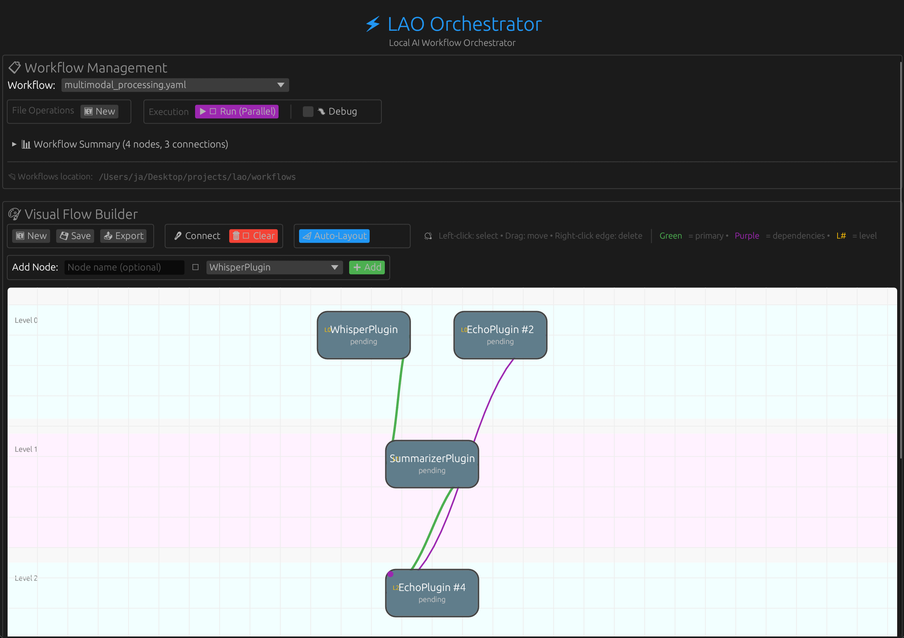

# ⚡️ LAO: Local AI Workflow Orchestrator


> Chain. Build. Run. All offline.
> LAO is how developers bend AI to their will—no cloud, no compromise.

---

## 🧠 What is LAO?

LAO is a cross-platform desktop tool for chaining local AI models and plugins into powerful, agentic workflows. It supports prompt-driven orchestration, visual DAG editing, and full offline execution.



*The LAO UI showing a workflow with hierarchical layout, execution levels, and color-coded connections. Notice:*
- *Level bands (alternating blue/purple) showing execution levels*
- *Level labels ("Level 0", "Level 1", "Level 2") on the left*
- *Green edges for primary inputs (`input_from`)*
- *Purple edges for parallel dependencies (`depends_on`)*
- *L# labels on nodes showing execution levels*
- *Auto-layout arranging nodes hierarchically*

---

## ✨ Features

- [x] **Modular plugin system** (Rust, local-first, dynamic loading)
- [x] **Offline DAG engine** (retries, caching, lifecycle hooks)
- [x] **Prompt-driven agentic workflows** (LLM-powered, system prompt file)
- [x] **Visual workflow builder** (egui-based native GUI, drag & drop)
- [x] **CLI interface** (run, validate, prompt, validate-prompts, plugin list)
- [x] **Prompt library** (Markdown + JSON, for validation/fine-tuning)
- [x] **Test harness** for prompt validation
- [x] **End-to-end execution** from UI (execute and show logs/results)
- [x] **UI streaming run** with real-time step events and parallel execution
- [x] **Parallel execution** with level-based concurrent processing and performance metrics
- [x] **Node/edge editing** in UI (drag, connect, edit, delete)
- [x] **Cross-platform support** (Linux, macOS, Windows)
- [x] **Conditional/branching steps** (output-based conditions)
- [ ] **Multi-modal input** (files, voice, images, video)
- [x] **Automated packaging** (deb, rpm, AppImage, dmg, msi, zip)
- [x] **CI/CD pipeline** (GitHub Actions, automated releases)
- [ ] Plugin explainability (`lao explain plugin <name>`)
- [ ] Plugin marketplace/discovery
- [ ] Live workflow status/logs in UI

---

## 🚀 Quickstart

### GUI (Recommended)
```sh
# Run the native GUI with visual workflow builder
cargo run --bin lao-ui
```

### CLI
```sh
# Run workflows from command line
cargo run --bin lao-cli run workflows/test.yaml

# Generate workflows from natural language
cargo run --bin lao-cli prompt "Summarize this audio and tag action items"

# Validate prompt library
cargo run --bin lao-cli validate-prompts
```

### Build Plugins
```sh
# Build all plugins for your platform
bash scripts/build-plugins.sh

# Or build plugins manually
cd plugins/EchoPlugin && cargo build --release
cd ../WhisperPlugin && cargo build --release
# ... etc for each plugin

# Then copy the built libraries to plugins/ directory
# On macOS: cp target/release/*.dylib ../../plugins/
# On Linux: cp target/release/*.so ../../plugins/
# On Windows: cp target/release/*.dll ../../plugins/
```

**Note**: Plugins must be built before running the UI. If you see "plugins not found", run the build script above.

---

## 📖 Tutorial: Using the LAO UI

### Getting Started

1. **Launch the UI**:
   ```sh
   cargo run --bin lao-ui
   ```

2. **Understanding the Interface**:
   - **Workflow Management** (top): Select and manage workflows
   - **Visual Flow Builder** (middle): Build workflows visually with nodes and connections
   - **Execution Logs** (bottom): View real-time execution status and logs

### Creating Your First Workflow

#### Step 1: Start Fresh
- Click **"🆕 New"** to clear the canvas and start a new workflow

#### Step 2: Add Nodes
- In the Visual Flow Builder, find the "Add Node" section
- Enter a node name (e.g., "process_data")
- Select a plugin from the dropdown (e.g., "EchoPlugin")
- Click **"➕ Add"** to create the node
- Repeat to add more nodes

#### Step 3: Connect Nodes
- Click the **"🔗 Connect"** button to enter connection mode
- **First click**: Select the source node (where data comes from)
- **Second click**: Select the target node (where data goes to)
- After connecting, click **"📐 Auto-Layout"** to automatically arrange nodes hierarchically by execution level
- The connection is created automatically
- Click **"🔗 Connect"** again to exit connection mode

#### Step 4: Set Primary Input (for nodes with multiple inputs)
- Click on a node that has multiple incoming connections
- A dialog appears showing all input sources
- Select which connection provides the **primary input** (the main data flow)
- Other connections become **parallel dependencies** (must complete but don't provide input)
- Click **"✓ Done"** to confirm

#### Step 5: Run Your Workflow
- Click **"▶️ Run"** to execute
- The button automatically detects if your workflow can run in parallel
- Watch the execution logs for real-time progress
- Node status indicators show: pending → running → success/error

### Loading Existing Workflows

1. **Select from Dropdown**:
   - Use the workflow dropdown at the top
   - Select a workflow file (e.g., "test.yaml")
   - The workflow automatically loads into the Visual Flow Builder

2. **Workflow Location**:
   - Workflows are stored in the `workflows/` directory
   - The full path is shown at the bottom of the Workflow Management section

### Understanding Visual Indicators

#### Node Colors & Status
- **Gray dot**: Pending
- **Blue dot**: Running
- **Green dot**: Success
- **Red dot**: Error
- **Purple dot**: Cached (skipped execution)

#### Edge Colors
- **Green (thick)**: Primary input (`input_from`) - main data flow
- **Purple (thin)**: Parallel dependency (`depends_on`) - must complete but doesn't provide input

#### Execution Levels
- **L# labels**: Show which execution level a node belongs to
- Nodes at the same level can run in parallel
- Levels execute sequentially (Level 0 → Level 1 → Level 2...)

#### Node Indicators
- **Purple dot (top-left)**: Fan-in node (receives multiple inputs)
- **Blue dot (bottom-right)**: Fan-out node (sends to multiple nodes)

### Parallel Execution

LAO automatically detects when workflows can run in parallel:

1. **Automatic Detection**:
   - The "Run" button shows **"▶️ Run (Parallel)"** in purple when parallel execution is possible
   - Otherwise, it shows **"▶️ Run"** in blue for sequential execution

2. **How It Works**:
   - Independent nodes (no dependencies) run simultaneously
   - Nodes at the same execution level run concurrently
   - Dependencies are respected automatically

3. **Debug Mode**:
   - Check **"🐛 Debug"** to force sequential execution
   - Useful for debugging or step-by-step execution
   - Overrides automatic parallel detection

### Workflow Patterns

#### Sequential Chain
```
Node A → Node B → Node C
```
All nodes run one after another.

#### Parallel Branches
```
Node A ──┐
         ├──→ Node D
Node B ──┤
         │
Node C ──┘
```
Nodes A, B, C run simultaneously, then Node D runs.

#### Fan-Out
```
Node A ──→ Node B
    └──→ Node C
    └──→ Node D
```
Node A feeds multiple parallel nodes.

#### Fan-In
```
Node A ──┐
         ├──→ Node D (uses A as primary input)
Node B ──┤
         │
Node C ──┘
```
Multiple nodes feed into one merge node.

### Managing Workflows

#### Saving Workflows
- Workflows are automatically saved to the `workflows/` directory
- Use the **"💾 Save"** button in the Visual Flow Builder
- Enter a filename (e.g., "my_workflow.yaml")

#### Exporting Workflows
- Click **"📤 Export"** to copy the workflow YAML to clipboard
- Useful for sharing or version control

#### Deleting Nodes/Edges
- **Delete node**: Select a node and press `Delete` key
- **Delete edge**: Right-click on an edge to remove it

### Tips & Best Practices

1. **Start Simple**: Begin with 2-3 nodes to understand the flow
2. **Use Meaningful Names**: Name nodes descriptively (e.g., "process_data" not "node1")
3. **Check Execution Levels**: Use L# labels to understand parallelism
4. **Monitor Logs**: Watch the execution logs for errors and debugging info
5. **Use Debug Mode**: Enable debug mode when troubleshooting
6. **Save Frequently**: Save your workflows regularly

### Example: Building a Simple Echo Chain

1. Click **"🆕 New"** to start fresh
2. Add first node: Name="start", Plugin="EchoPlugin", click **"➕ Add"**
3. Add second node: Name="middle", Plugin="EchoPlugin", click **"➕ Add"**
4. Add third node: Name="end", Plugin="EchoPlugin", click **"➕ Add"**
5. Click **"🔗 Connect"**, then click "start" → "middle" → "end"
6. Click **"▶️ Run"** to execute
7. Watch the logs to see each step execute sequentially

### Troubleshooting

- **"No workflows found"**: Ensure workflow YAML files exist in the `workflows/` directory
- **Workflow won't load**: Check that the YAML file is valid and plugins are available
- **Nodes not connecting**: Make sure you're in Connect mode (button highlighted)
- **Execution fails**: Check the execution logs for error messages

---

## 🧩 Prompt-Driven Workflows

LAO can generate and execute workflows from natural language prompts using a local LLM (Ollama). The system prompt is editable at `core/prompt_dispatcher/prompt/system_prompt.txt`.

Example:
```bash
lao prompt "Refactor this Python file and add comments"
```

---

## 📚 Prompt Library & Validation

- Prompts and expected workflows: `core/prompt_dispatcher/prompt/prompt_library.md` and `.json`
- Validate with: `cargo run --bin lao-cli validate-prompts`
- Add new prompts to improve LLM output and test new plugins

---

## 🛠️ Contributing Plugins & Prompts
- Add new plugins by implementing the `LaoPlugin` trait, building as a `cdylib`, and placing the resulting library in the `plugins/` directory
- Expose a C ABI function named `plugin_entry_point` that returns a `Box<dyn LaoPlugin>`
- Add prompt/workflow pairs to the prompt library for validation and LLM tuning
- See `docs/plugins.md` and `docs/workflows.md` for details

---

## 📄 Documentation
- Architecture: `docs/architecture.md`
- Plugins: `docs/plugins.md`
- Workflows: `docs/workflows.md`
- CLI: `docs/cli.md`
- Observability: `docs/observability.md`

---

## 🌌 Manifesto
Cloud is optional. Intelligence is modular. Agents are composable.  
LAO is how devs build AI workflows with total control.  
**No tokens. No latency. No lock-in.**

Let’s define the category—one plugin at a time.